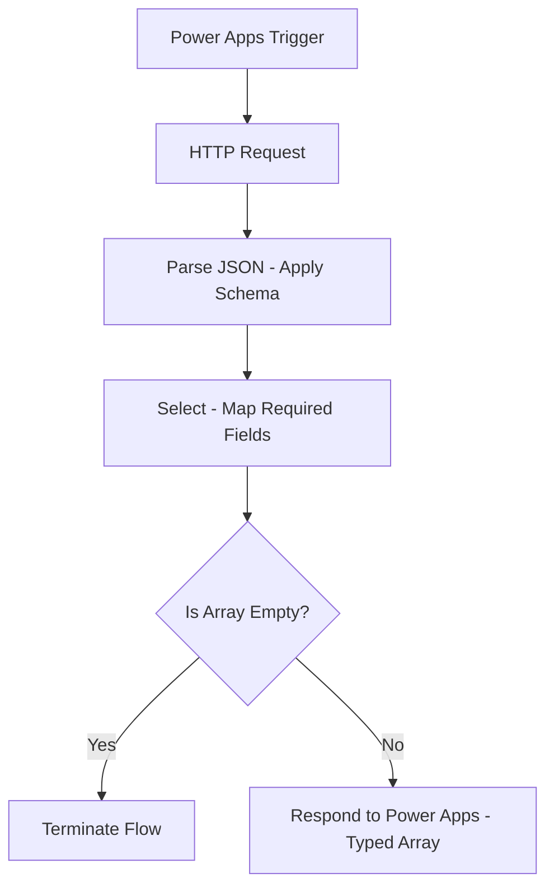

# PowerApps Typed Response Flow

[](LICENSE)


---

## Overview
**PowerApps Typed Response Flow** is a reusable Power Automate flow template designed to securely retrieve data from an external API, apply a defined schema, and return a strongly typed dataset to Power Apps.  
It effectively resolves the common **“untyped object”** error, improving data reliability and enabling direct field referencing in Power Fx formulas.

---

## Problem Statement
When Power Apps receives dynamic or loosely typed JSON from a Power Automate flow, it cannot infer the schema and produces an *untyped object*.  
This limitation prevents developers from easily binding data to controls or accessing fields without additional transformations.

---

## Solution Approach
This flow enforces a predictable data structure before sending results to Power Apps:

1. **Trigger** – Initiated from Power Apps.
2. **HTTP Action** – Retrieves raw data from the target API.
3. **Parse JSON** – Applies a well-defined schema to structure the response.
4. **Select Action** – Extracts and maps only the required fields into a clean object array.
5. **Condition Check** – Validates the dataset; terminates early if no records are found.
6. **Respond to Power Apps** – Returns a fully typed dataset, ensuring compatibility and ease of use.

---

## Flow Logic (Mermaid Diagram)


## Prerequisites

| Requirement            | Notes                                                     |
| ---------------------- | --------------------------------------------------------- |
| Power Automate License | Any tier supporting custom flows                          |
| Connections            | HTTP and Power Apps                                       |
| API Details            | Base URL and authentication credentials (stored securely) |

## Usage in Power Apps

```
// Run the flow and store the result
ClearCollect(
    colApiData,
    PowerAppsTypedResponseFlow.Run()
);

// Bind data to a gallery
Gallery1.Items = colApiData;
Label_Name.Text = ThisItem.Name;

```

## Environment Variables

| Variable     | Purpose                | Example Value             |
| ------------ | ---------------------- | ------------------------- |
| `ApiBaseUrl` | REST API root endpoint | `https://api.example.com` |
| `ApiKey`     | API authentication key | `ABC123SECRET`            |

## Credits

- [**Dileep**](https://github.com/dileepsuggala) – Contributor  
- [**Sai**](https://github.com/msdev777) – Contributor  
- [**Vasavi**](https://github.com/vasavisuggala) – Contributor, Maintainer & Publisher  

## Contact
**Maintainer:** [Vasavi](https://github.com/vasavisuggala)  
**GitHub:** [https://github.com/vasavisuggala/PowerApps-typed-response-flow](https://github.com/vasavisuggala/PowerApps-typed-response-flow)
